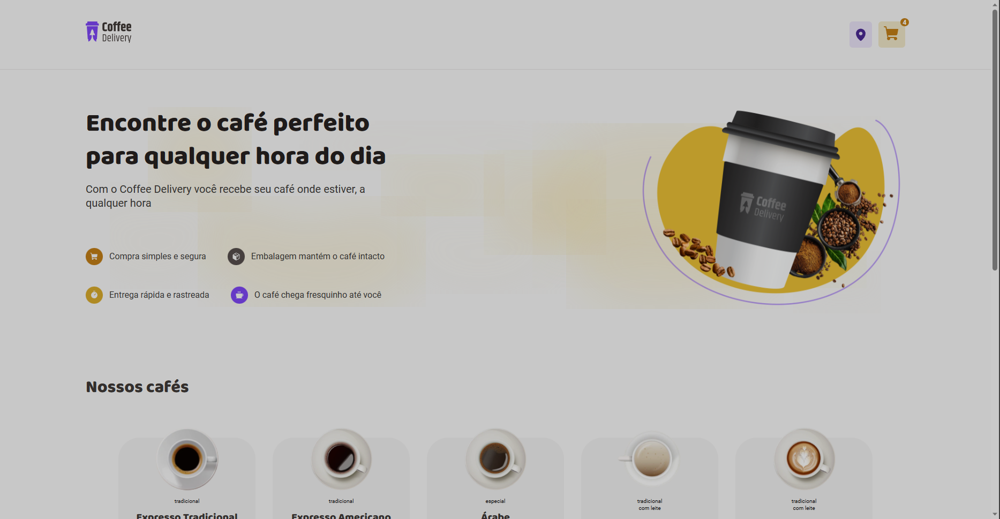

<h1>Coffee Delivery</h1>

<a href="https://coffee-delivery-amber-phi.vercel.app" target="_blank">☕Café</a>

Bem-vindo(a) ao nosso incrível mundo do café! Aqui você descobrirá uma ampla variedade de café, cuidadosamente selecionados para garantir uma experiência de qualidade incomparável. De clássicos expressos tradicionais a joias raras como o Café Cubano, que é o queridinho de todos, temos algo para agradar até mesmo os paladares mais exigentes.

Aproveite a comodidade da entrega e do serviço de delivery disponíveis exclusivamente para nossa cidade local. Basta preencher um pequeno formulário e nós levaremos o nosso produto diretamente à sua porta. Você desfrutará de uma compra simples e segura, com embalagens projetadas para preservar a frescura e o sabor do café. E para garantir sua tranquilidade, oferecemos um serviço de entrega rápida.

Venha experimentar o prazer de um café autêntico e encante-se com a qualidade e o cuidado que colocamos em cada xícara. Junte-se a nós nesta jornada sensorial e descubra o verdadeiro sabor do café feito com paixão e dedicação. Seja bem-vindo(a) ao lugar onde os amantes do café se encontram!☕

Acessível também pelo celular!

 

<h2> ⚙Funcionalidades </h2>

- Listagem de produtos (cafés) disponíveis para compra
- Adicionar uma quantidade específicas de itens no carrinho
- Aumentar ou remover a quantidade de itens no carrinho
- Formulário para o usuário preencher o seu endereço
- Exibir o total de itens no carrinho no Header
- Exibir o valor total da soma de itens no carrinho multiplicados pelo valor
- Mostra a localização no google maps de acordo com o CEP e CIDADE que for preenchido no formulário

Neste projeto, exploramos diversas funcionalidades que exigiram a aplicação de conceitos refinados, tais como:

- Estados
- ContextAPI
- LocalStorage
- Imutabilidade do estado
- Listas e chaves no ReactJS
- Propriedades
- Componentização

 

<h2> 🛠Tecnologias principais usadas </h2>

* React
* Styled-components
* Html
* Typescript
* Yarn

 

<h2 align='center'> Meus contatos </h2>

* [LinkedIn](https://www.linkedin.com/in/romeu-soares-87749a231/)

* romeuindexjs@gmail.com

* WhatsApp: 84 981127596